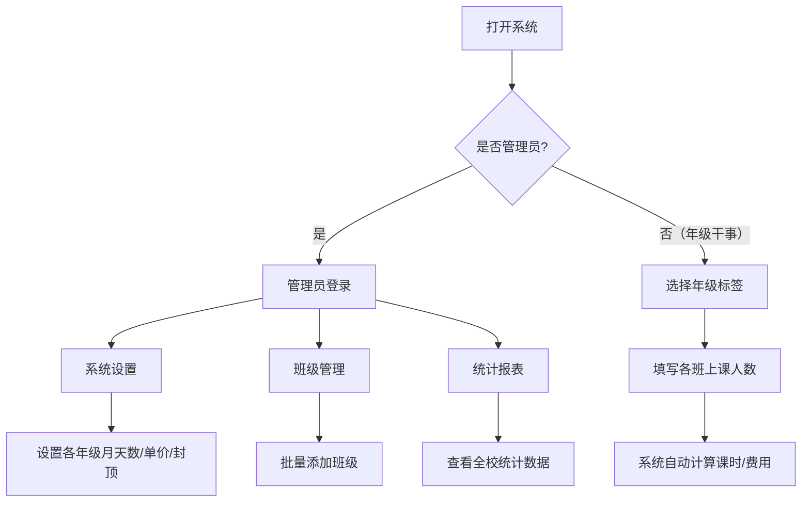

## 1. 产品概述

课后服务预算管理系统，专为小学设计，用于管理6个年级的课后服务费用预算。
- 核心功能：设置各年级每月上课天数、课程单价和封顶价格；统计各班级每节课的上课人数及课时数；统计教师上课节数
- 目标用户：小学年级干事（无需登录）、学校管理员
- 价值：简化课后服务预算统计流程，支持手机微信端便捷访问

## 2. 核心功能

### 2.1 用户角色
| 角色 | 登录方式 | 核心权限 |
|------|---------|---------|
| 年级干事 | 无需账号密码 | 选择对应年级标签，填写本年级各班上课人数、课时信息 |
| 管理员 | 账号密码登录 | 系统设置（年级天数、单价、封顶价）、班级管理、查看全校统计数据 |

### 2.2 功能模块
1. **系统首页**：年级标签导航、管理员登录入口
2. **年级数据填写页**：选择年级后，以班级为单位填写每节课的上课人数
3. **系统设置页（管理员）**：设置各年级每月天数、课程单价、封顶价格
4. **班级管理页（管理员）**：管理6个年级的班级，支持批量添加
5. **统计报表页（管理员）**：查看全校各年级、各班级的预算统计和教师课时统计

### 2.3 页面详情
| 页面名称 | 模块名称 | 功能描述 |
|---------|---------|---------|
| 首页 | 年级标签导航 | 显示6个年级的卡片/标签，点击进入对应年级填写页；底部显示管理员登录入口 |
| 首页 | 快捷统计概览 | 展示当前月份的统计概览数据 |
| 年级填写页 | 班级课时列表 | 显示该年级所有班级，每个班级可填写当月的上课节次及对应人数 |
| 年级填写页 | 自动计算 | 课时数 = 上课人数 × 课节数，自动计算并显示 |
| 系统设置页 | 月度参数设置 | 设置每个年级每月的上课天数、单价（如13元/节）、封顶价格（如190元/人） |
| 班级管理页 | 年级班级管理 | 每个年级可批量添加班级（如一班、二班...），支持编辑和删除 |
| 统计报表页 | 预算统计 | 按年级/班级展示月度预算统计，含人数、课时数、费用汇总 |
| 统计报表页 | 教师课时统计 | 统计每个年级的教师上课节数 |

## 3. 核心流程

1. **管理员初始化流程**：管理员登录 → 设置各年级月度参数（天数、单价、封顶价） → 批量添加各年级班级 → 完成初始化
2. **年级干事填写流程**：打开网站 → 点击对应年级标签 → 查看班级列表 → 填写各班每节课的上课人数 → 系统自动计算课时数和费用
3. **数据查看流程**：管理员登录 → 查看统计报表 → 按年级/月份筛选 → 导出数据



## 4. 用户界面设计

### 4.1 设计风格
- **主色调**：深蓝(#1a237e) + 天蓝(#42a5f5)，营造专业、可信赖的教育氛围
- **辅助色**：暖橙(#ff8f00)作为重点强调色，浅灰(#f5f5f5)作为背景
- **按钮样式**：大圆角(full rounded)、柔和阴影、渐变色填充
- **字体**：系统原生字体栈，保证微信内置浏览器兼容性
- **布局**：卡片式设计，顶部导航简洁，内容区域留白充足
- **图标风格**：使用SVG内联图标或Unicode符号，减少外部依赖

### 4.2 页面设计概览
| 页面名称 | 模块名称 | UI元素 |
|---------|---------|--------|
| 首页 | 年级导航 | 6个大圆角卡片，每个卡片显示年级名称和年级缩写数字 |
| 首页 | 管理员入口 | 底部小字链接"管理员登录" |
| 年级填写页 | 班级列表 | 卡片列表形式，每张卡片显示班级名称、上课节次输入区、人数输入框 |
| 系统设置页 | 参数表单 | 表格形式，行=年级，列=天数/单价/封顶价输入框 |
| 班级管理页 | 批量添加 | 输入框（如1-6表示添加6个班）+ 班级列表展示 |
| 统计报表页 | 数据表格 | 卡片式数据展示，含汇总行 |

### 4.3 响应式设计
- **移动优先**：完全适配手机屏幕，特别针对微信内置浏览器优化
- 手机端：单列布局，卡片全宽，字体不小于16px防止iOS缩放
- 平板端：双列网格布局
- 桌面端：三列或四列布局，最大宽度1200px居中

## 5. 数据模型

### 5.1 ER图

```mermaid
erDiagram
    GRADE ||--o{ CLASS : contains
    GRADE ||--o{ GRADE_SETTING : has
    CLASS ||--o{ ATTENDANCE : records
    GRADE ||--o{ TEACHER_LESSON : has
    GRADE {
        int id PK
        string name
        int sort_order
    }
    CLASS {
        int id PK
        int grade_id FK
        string name
    }
    GRADE_SETTING {
        int id PK
        int grade_id FK
        int year
        int month
        int teaching_days
        decimal unit_price
        decimal cap_price
    }
    ATTENDANCE {
        int id PK
        int class_id FK
        int lesson_number
        int student_count
        decimal lesson_hours
        int year
        int month
    }
    TEACHER_LESSON {
        int id PK
        int grade_id FK
        string teacher_name
        int lesson_count
        int year
        int month
    }
    ADMIN_USER {
        int id PK
        string username
        string password_hash
    }
```

### 5.2 数据库DDL

```sql
CREATE TABLE grades (
    id INT AUTO_INCREMENT PRIMARY KEY,
    name VARCHAR(20) NOT NULL COMMENT '年级名称',
    sort_order INT NOT NULL DEFAULT 0 COMMENT '排序',
    created_at TIMESTAMP DEFAULT CURRENT_TIMESTAMP
) ENGINE=InnoDB DEFAULT CHARSET=utf8mb4;

CREATE TABLE classes (
    id INT AUTO_INCREMENT PRIMARY KEY,
    grade_id INT NOT NULL,
    name VARCHAR(50) NOT NULL COMMENT '班级名称',
    created_at TIMESTAMP DEFAULT CURRENT_TIMESTAMP,
    FOREIGN KEY (grade_id) REFERENCES grades(id) ON DELETE CASCADE
) ENGINE=InnoDB DEFAULT CHARSET=utf8mb4;

CREATE TABLE grade_settings (
    id INT AUTO_INCREMENT PRIMARY KEY,
    grade_id INT NOT NULL,
    year INT NOT NULL,
    month INT NOT NULL,
    teaching_days INT NOT NULL DEFAULT 0 COMMENT '上课天数',
    unit_price DECIMAL(10,2) NOT NULL DEFAULT 0 COMMENT '每节课单价',
    cap_price DECIMAL(10,2) NOT NULL DEFAULT 0 COMMENT '每人封顶价',
    FOREIGN KEY (grade_id) REFERENCES grades(id) ON DELETE CASCADE,
    UNIQUE KEY uk_grade_month (grade_id, year, month)
) ENGINE=InnoDB DEFAULT CHARSET=utf8mb4;

CREATE TABLE attendance (
    id INT AUTO_INCREMENT PRIMARY KEY,
    class_id INT NOT NULL,
    lesson_number INT NOT NULL COMMENT '第几节课',
    student_count INT NOT NULL DEFAULT 0 COMMENT '上课人数',
    lesson_hours DECIMAL(10,1) NOT NULL DEFAULT 0 COMMENT '课时数',
    year INT NOT NULL,
    month INT NOT NULL,
    created_at TIMESTAMP DEFAULT CURRENT_TIMESTAMP,
    updated_at TIMESTAMP DEFAULT CURRENT_TIMESTAMP ON UPDATE CURRENT_TIMESTAMP,
    FOREIGN KEY (class_id) REFERENCES classes(id) ON DELETE CASCADE,
    UNIQUE KEY uk_class_lesson (class_id, lesson_number, year, month)
) ENGINE=InnoDB DEFAULT CHARSET=utf8mb4;

CREATE TABLE teacher_lessons (
    id INT AUTO_INCREMENT PRIMARY KEY,
    grade_id INT NOT NULL,
    teacher_name VARCHAR(50) NOT NULL COMMENT '教师姓名',
    lesson_count INT NOT NULL DEFAULT 0 COMMENT '上课节数',
    year INT NOT NULL,
    month INT NOT NULL,
    FOREIGN KEY (grade_id) REFERENCES grades(id) ON DELETE CASCADE
) ENGINE=InnoDB DEFAULT CHARSET=utf8mb4;

CREATE TABLE admin_users (
    id INT AUTO_INCREMENT PRIMARY KEY,
    username VARCHAR(50) NOT NULL UNIQUE,
    password_hash VARCHAR(255) NOT NULL,
    created_at TIMESTAMP DEFAULT CURRENT_TIMESTAMP
) ENGINE=InnoDB DEFAULT CHARSET=utf8mb4;

-- 初始数据
INSERT INTO grades (name, sort_order) VALUES 
('一年级', 1), ('二年级', 2), ('三年级', 3), 
('四年级', 4), ('五年级', 5), ('六年级', 6);

INSERT INTO admin_users (username, password_hash) VALUES 
('admin', '$2y$10$92IXUNpkjO0rOQ5byMi.Ye4oKoEa3Ro9llC/.og/at2.uheWG/igi');
-- 默认密码: password
```