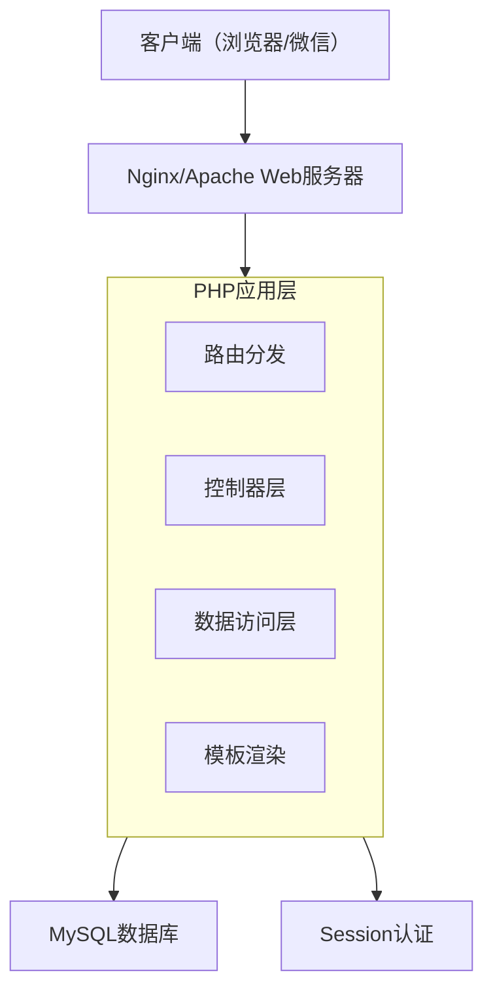
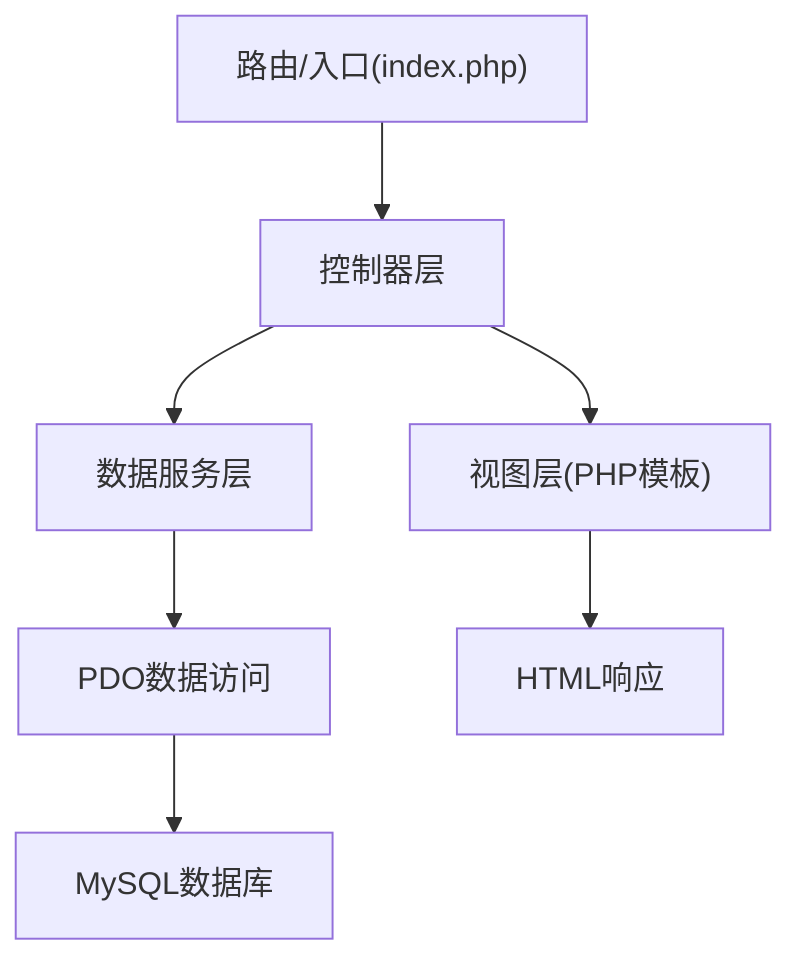

## 1. 架构设计



## 2. 技术说明

- **前端**：原生HTML5 + CSS3 + JavaScript，无外部框架依赖（保证微信兼容性）
- **后端**：PHP 7.4+，使用PDO连接MySQL
- **数据库**：MySQL 5.7+ / MariaDB 10.3+
- **Web服务器**：内置PHP内置开发服务器（开发环境），生产环境推荐Nginx
- **响应式**：纯CSS Flexbox/Grid实现，无前端框架
- **字体图标**：使用Font Awesome CDN或Unicode符号

## 3. 路由定义

| 路由 | 方法 | 用途 |
|------|------|------|
| `/` | GET | 首页 - 年级导航 + 管理员登录入口 |
| `/grade.php?g={id}` | GET | 年级干事填写页 |
| `/grade.php?g={id}` | POST | 提交年级上课数据 + 校外教师课时 |
| `/admin/login.php` | GET | 管理员登录页 |
| `/admin/login.php` | POST | 管理员登录提交 |
| `/admin/dashboard.php` | GET | 管理员后台首页 |
| `/admin/settings.php` | GET/POST | 月度参数设置 |
| `/admin/classes.php` | GET/POST | 班级管理 |
| `/admin/statistics.php` | GET | 统计报表（含教师课时管理） |
| `/admin/teacher_lessons.php` | GET/POST | 校外教师课时管理（新增/编辑/删除） |
| `/admin/logout.php` | GET | 退出登录 |
| `/api/data.php` | GET | 获取统计数据（AJAX） |
| `/api/teacher_lessons.php` | POST | 教师课时CRUD操作（AJAX） |

## 4. API定义

### 年级数据API
```php
// GET /api/data.php?action=grade_stats&grade_id=1&year=2026&month=4
// 返回指定年级的统计数据
[
  'grade_name' => '一年级',
  'settings' => [
    'teaching_days' => 20,
    'unit_price' => 13.00,
    'cap_price' => 190.00
  ],
  'classes' => [
    [
      'class_id' => 1,
      'class_name' => '一班',
      'attendance' => [
        ['lesson_number' => 1, 'student_count' => 40, 'lesson_hours' => 40.0],
        ['lesson_number' => 2, 'student_count' => 38, 'lesson_hours' => 38.0]
      ]
    ]
  ],
  'teacher_lessons' => [
    ['id' => 1, 'teacher_name' => '张老师', 'lesson_count' => 20]
  ]
]

// POST /grade.php?g={id} 提交数据
// request: {
//   attendance: [{ class_id: 1, lesson_number: 1, student_count: 40 }, ...],
//   teachers: [{ teacher_name: "张老师", lesson_count: 20 }, ...]
// }

// POST /api/teacher_lessons.php 教师课时管理（管理员）
// action: add    -> { grade_id, teacher_name, lesson_count, year, month }
// action: edit   -> { id, teacher_name, lesson_count }
// action: delete -> { id }
// response: { success: true }
```

## 5. 服务器架构图



## 6. 目录结构

```
/
├── index.php                # 首页 - 年级导航
├── grade.php                # 年级填写页
├── config.php               # 数据库配置
├── db.php                   # 数据库连接类
├── style.css                # 全局样式
├── app.js                   # 前端交互脚本
├── admin/
│   ├── login.php            # 管理员登录
│   ├── dashboard.php        # 管理后台首页
│   ├── settings.php         # 参数设置
│   ├── classes.php          # 班级管理
│   ├── statistics.php       # 统计报表
│   └── logout.php           # 退出
├── api/
│   └── data.php             # AJAX数据接口
└── install.php              # 数据库安装脚本
```

## 7. 数据模型

### 7.1 数据模型定义

```mermaid
erDiagram
    GRADE ||--o{ CLASS : "包含"
    GRADE ||--o{ GRADE_SETTING : "拥有"
    CLASS ||--o{ ATTENDANCE : "记录"
    GRADE ||--o{ TEACHER_LESSON : "统计"
    
    GRADE {
        int id PK
        string name
        int sort_order
    }
    
    CLASS {
        int id PK
        int grade_id FK
        string name
    }
    
    GRADE_SETTING {
        int id PK
        int grade_id FK
        int year
        int month
        int teaching_days
        decimal unit_price
        decimal cap_price
    }
    
    ATTENDANCE {
        int id PK
        int class_id FK
        int lesson_number
        int student_count
        decimal lesson_hours
        int year
        int month
        datetime created_at
    }
    
    TEACHER_LESSON {
        int id PK
        int grade_id FK
        string teacher_name
        int lesson_count
        int year
        int month
    }
    
    ADMIN_USER {
        int id PK
        string username
        string password_hash
        datetime created_at
    }
```

### 7.2 数据库定义语言

```sql
-- 创建数据库
CREATE DATABASE IF NOT EXISTS afterschool_budget CHARACTER SET utf8mb4 COLLATE utf8mb4_unicode_ci;
USE afterschool_budget;

-- 年级表
CREATE TABLE grades (
    id INT AUTO_INCREMENT PRIMARY KEY,
    name VARCHAR(20) NOT NULL COMMENT '年级名称',
    sort_order INT NOT NULL DEFAULT 0 COMMENT '排序',
    created_at TIMESTAMP DEFAULT CURRENT_TIMESTAMP
) ENGINE=InnoDB DEFAULT CHARSET=utf8mb4;

-- 班级表
CREATE TABLE classes (
    id INT AUTO_INCREMENT PRIMARY KEY,
    grade_id INT NOT NULL COMMENT '所属年级',
    name VARCHAR(50) NOT NULL COMMENT '班级名称',
    created_at TIMESTAMP DEFAULT CURRENT_TIMESTAMP,
    FOREIGN KEY (grade_id) REFERENCES grades(id) ON DELETE CASCADE
) ENGINE=InnoDB DEFAULT CHARSET=utf8mb4;

-- 年级设置表
CREATE TABLE grade_settings (
    id INT AUTO_INCREMENT PRIMARY KEY,
    grade_id INT NOT NULL,
    year INT NOT NULL,
    month INT NOT NULL,
    teaching_days INT NOT NULL DEFAULT 0 COMMENT '上课天数',
    unit_price DECIMAL(10,2) NOT NULL DEFAULT 0.00 COMMENT '每节课单价',
    cap_price DECIMAL(10,2) NOT NULL DEFAULT 0.00 COMMENT '每人封顶价',
    FOREIGN KEY (grade_id) REFERENCES grades(id) ON DELETE CASCADE,
    UNIQUE KEY uk_grade_month (grade_id, year, month)
) ENGINE=InnoDB DEFAULT CHARSET=utf8mb4;

-- 上课记录表
CREATE TABLE attendance (
    id INT AUTO_INCREMENT PRIMARY KEY,
    class_id INT NOT NULL,
    lesson_number INT NOT NULL COMMENT '课节序号',
    student_count INT NOT NULL DEFAULT 0 COMMENT '上课学生数',
    lesson_hours DECIMAL(10,1) NOT NULL DEFAULT 0.0 COMMENT '课时数',
    year INT NOT NULL,
    month INT NOT NULL,
    created_at TIMESTAMP DEFAULT CURRENT_TIMESTAMP,
    updated_at TIMESTAMP DEFAULT CURRENT_TIMESTAMP ON UPDATE CURRENT_TIMESTAMP,
    FOREIGN KEY (class_id) REFERENCES classes(id) ON DELETE CASCADE,
    UNIQUE KEY uk_class_lesson (class_id, lesson_number, year, month)
) ENGINE=InnoDB DEFAULT CHARSET=utf8mb4;

-- 教师课时统计表
CREATE TABLE teacher_lessons (
    id INT AUTO_INCREMENT PRIMARY KEY,
    grade_id INT NOT NULL,
    teacher_name VARCHAR(50) NOT NULL COMMENT '教师姓名',
    lesson_count INT NOT NULL DEFAULT 0 COMMENT '上课节数',
    year INT NOT NULL,
    month INT NOT NULL,
    FOREIGN KEY (grade_id) REFERENCES grades(id) ON DELETE CASCADE
) ENGINE=InnoDB DEFAULT CHARSET=utf8mb4;

-- 管理员表
CREATE TABLE admin_users (
    id INT AUTO_INCREMENT PRIMARY KEY,
    username VARCHAR(50) NOT NULL UNIQUE,
    password_hash VARCHAR(255) NOT NULL,
    created_at TIMESTAMP DEFAULT CURRENT_TIMESTAMP
) ENGINE=InnoDB DEFAULT CHARSET=utf8mb4;

-- 初始数据
INSERT INTO grades (name, sort_order) VALUES 
('一年级', 1), ('二年级', 2), ('三年级', 3), 
('四年级', 4), ('五年级', 5), ('六年级', 6);

-- 默认管理员账号: admin / admin123
INSERT INTO admin_users (username, password_hash) VALUES 
('admin', '$2y$10$YourHashedPasswordHere');
```

## 8. 安全方案

- 管理员密码使用 `password_hash()` 加密存储
- 所有用户输入使用 `htmlspecialchars()` 防止XSS
- 数据库操作使用PDO预处理语句防止SQL注入
- 管理员会话使用PHP Session管理
- 年级干事操作无需登录，通过URL参数区分年级

## 9. 部署要求

- PHP 7.4+（需开启PDO、MySQL扩展）
- MySQL 5.7+ / MariaDB 10.3+
- 运行方式：`php -S 0.0.0.0:8080` 或部署到Nginx/Apache
- 微信浏览器支持：使用原生HTML/CSS/JS，避免使用现代ES模块